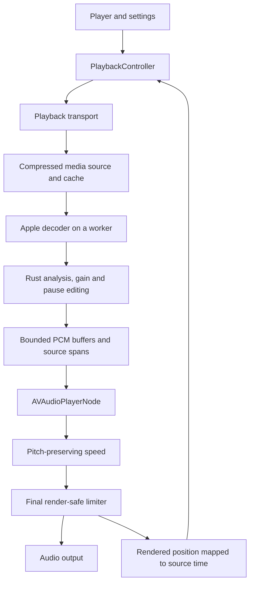

# Podcst audio experience

Status: milestone 1 in progress; M1.1–M1.5 complete. Next: M1.6, rendered-output, corpus and physical-device validation. Baseline: `31ae363` and `ac54242`, reviewed 27 September 2026. Milestone 2 remains planned.

This is the implementation and acceptance plan for native Volume Boost and Trim Silence on iOS 18 and later. Update the work ledger when a change lands. Record measured evidence before marking a gate complete; a successful build is not evidence of sound quality or device reliability.

## Product outcome

Listening should feel immediate and dependable. Quiet speech becomes easier to hear without pumping, harsh peaks, or amplified background noise. Trimming shortens dead air while preserving words, breaths, and conversational rhythm. Effects can change during playback without restarting the episode, losing position, or producing clicks.

Chapter timestamps, show-note links, skips, resume sync, and the lock-screen position always refer to the original episode. Downloaded episodes work offline. Supported progressive streams use the same effects as downloads. The UI reports when a requested effect cannot apply to a particular source or route.

Both effects default off. Keep the current speed choices and temporary double-speed gesture. Start with one carefully tuned trim setting; additional intensity presets require listening evidence. Global defaults and explicit per-podcast overrides are part of milestone 2. Effective settings are computed from those two sources, never separately persisted.

## Milestones

| Milestone | Deliverable | Completion boundary |
| --- | --- | --- |
| 1: Native foundation | Reusable Rust bridge and local-file AVAudioEngine test player, with correct source time, seeking, speed, limiting, and lifecycle behavior. | Automated audio-output tests and physical-device evidence pass. Normal episode playback continues using the current transport during this milestone. |
| 2: Production listening | Live Volume Boost and Trim Silence, app integration, durable downloads, progressive playback/cache, accessible controls, and full session/sync behavior. | Effects work on the declared source/route matrix, all release gates pass, and limitations are represented honestly in the UI. |

Milestone 1 is the first slice of the production architecture. It must not become a disposable second player. Downloaded-file integration is an intermediate milestone 2 checkpoint; it does not complete progressive-streaming support.

Out of scope: an AVPlayer-tap effects implementation, new codecs written in Rust, video/HLS editing, server-side audio transformation, web DSP, Chromecast DSP, CarPlay UI, sleep timers, a permanent listening-statistics system, EQ presets, and a claim of certified loudness/true-peak compliance.

## Starting point

| Component | Existing capability | Work required |
| --- | --- | --- |
| `audio-engine/src/analysis.rs` | Bounded loudness measurement and fixed/adaptive silence classification; reset, seek, finish. | A causal level controller, reusable frame decisions, and measured processing cost. Closed-pause events alone cannot drive bounded live editing. |
| `audio-engine/src/processing.rs` | Fixed gain and lookahead limiter with bounded caller-owned output; offline pause editing and timeline mapping. | Render integration, online pause editing, smooth configuration changes, and streaming timeline spans. |
| `audio-engine/src/ffi.rs` | Bounded C ABI, mechanically checked header, Apple packaging and a final render Audio Unit used by the local backend. | Validate final graph peaks and physical output; add causal leveling and online pause editing in M2. |
| `ios/Podcst/Playback/PlaybackController.swift` | Queue, persistence, sessions, chapters, Now Playing and remote commands; injected AVPlayer/local transports and monotonic progress cadence. | Validate local transport on physical routes; serialize/coalesce network progress writes in M2.4. |
| `ios/Podcst/NowPlayingView.swift` | Speed and route controls, chapters, notes and queue. | One accessible audio-controls sheet, clear settings scope and actual effect availability. |
| Native storage | Feed/artwork caching and playback state. | Compressed media storage, download lifecycle, range fetching, media identity and eviction. Feed caching is not an audio cache. |

The whole-file Rust processing functions remain reference tools. They must not run on complete episodes in the app. One two-hour 48 kHz stereo float32 buffer is approximately 2.76 GB before copies.

## Architecture and ownership



- `PlaybackController` owns queue policy, user intent, source-time presentation, persistence, sync, sessions and system controls. The backend owns loading, decoding, playback readiness, rendering, seeking and transport errors. Metadata/chapter loading is independent of the renderer.
- Use AVAudioPlayerNode to schedule bounded processed buffers. Introduce a source node only if measurement exposes a scheduling or clock limitation that requires it.
- Use Apple decoding for local MP3, AAC/M4A and PCM fixtures. Keep decoder/source interfaces independent of whether bytes come from a complete file or a progressive cache. Do not assume AVAudioFile can reliably read every partially downloaded container.
- Rust owns signal processing and edit decisions. Swift owns transport and platform integration. A minimal Objective-C/C render adapter may connect the final Rust limiter to an Audio Unit. Avoid object allocation, ARC traffic, locks, logging, dispatch, actor access and I/O in render callbacks.
- Put the final limiter after time stretching. Measure the final graph output, including sample-rate conversion; a ceiling measured before time stretching is insufficient. Account for both algorithmic and device/output latency.
- During integration AVPlayer remains the ordinary path until its replacement passes the gates. Afterwards keep it only for explicitly unsupported media/route capabilities, not a second effects implementation. Backend changes are lifecycle transitions at a source position, never implicit mid-buffer substitutions.

## Contracts to establish first

### Rust/native boundary

Use opaque processor handles, a generated or mechanically checked C header, fixed-width integer types and explicit status codes. Package device arm64 and simulator arm64/x86_64 slices from the same source revision. Generated binaries stay out of Git. Build scripts fail clearly when prerequisites are missing and support a clean checkout.

PCM is finite interleaved float32 with explicit sample rate and channel count. Begin with mono/stereo; unsupported formats are rejected or converted on the decoder worker. Frame counts always mean frames, not samples or bytes. Normalize planar decoder output at one boundary.

Create/configure/reset/destroy happen on the owning non-render context. Process takes input and caller-owned output capacity and reports consumed/emitted frames. Insufficient capacity has a defined, testable result without losing input. Finish drains pending real audio exactly once; it may require repeated bounded output calls. Invalid arguments do not mutate state. Error paths and panics must never unwind across the C boundary.

Memory limits, latency, supported formats and effect capabilities are explicit. The render-Audio-Unit adapter supplies the requested frame count during priming/draining, with a defined startup-silence and latency contract; do not directly substitute the worker API's variable frame output. Parameter changes are serialized at a defined audio boundary and smoothly ramped. Objects and buffers remain alive until every render callback that can use them has retired. Share algorithms between the native path and reference harness; do not maintain duplicate processors for old and new callers.

### Execution and buffering

Use one serial decode/processing owner and bounded producer/consumer storage. Decoding pauses at the high-water mark. Budget already-processed and scheduled audio against the setting-application target; a long queue cannot provide immediate changes unless retained source PCM can be reprocessed safely. Rendering never waits for the worker. Empty output is an underrun/buffering condition, never end of episode; output silence without advancing the source clock, then recover from the same source position. Starvation must not call Rust finish or discard pending real audio. Drain only after verified EOF; a recovery rebuild must let pending audio pass before retiring its processor.

M1.5 recovers starvation by allowing the current graph's pending audio to pass, then rebuilding at the last scheduled source boundary. It never calls Rust finish on starvation. This uses the same provisional 250 ms TimePitch tail allowance as EOF; M1.6 must validate this recovery across the format/rate corpus before it becomes the production policy.

Each load, seek, stop and graph rebuild changes a generation token. Every scheduled buffer, completion, worker result and pending seek belongs to a generation. Discard obsolete work. A stopped buffer's completion callback cannot finish an episode. Completion requires confirmed decoder EOF, drained editor/limiter tails, and the final audio actually played for the active generation.

### Clocks and seeking

Keep three meanings separate: original source frames, emitted content frames, and device/render time. Use 64-bit frame counters. Attach half-open source spans to retained output blocks, merge adjacent spans and discard already-played mapping history. No episode-length PCM or edit list is needed for forward playback.

Position comes from the rendered clock and its source mapping, not the decoder head, last scheduled buffer or wall clock multiplied by the current rate. Verify AVAudioPlayerNode clock behavior under live speed changes and downstream latency before relying on it.

M1.5 uses the final Audio Unit's rendered-frame counter, adjusted for limiter latency and downstream presentation latency. Each graph has one constant rate and source origin. Measured TimePitch read-ahead and live rate-transition errors rule out its input player clock as the presented position. Rate changes and pause/resume rebuild at that position; seamless transitions remain a production-promotion requirement.

Seeking uses original episode time, flushes old queued output and processing state, and establishes a new source origin. Decode pre-roll where required; never render it. A direct seek into a previously trimmed interval reopens the source at the requested position and warms up processing conservatively. Mapping an already-committed edit boundary advances to its next retained source frame. Do not maintain a global edited-file timeline for seeking.

Keep episode duration and displayed remaining time on the source timeline. Do not promise an exact time-to-finish for unanalyzed audio. Refresh Now Playing position when a committed trim is heard and after rate/seek changes. Update the displayed rate honestly; do not replace the selected speed with a guessed average trim speed.

Progress saves use monotonic elapsed playback time, plus explicit pause, seek completion, episode switch and completion events. The payload is always source time. Backward seeking must not postpone the next periodic save until the old position is reached. Serialize/coalesce writes so an older request cannot overwrite a newer seek.

Interruption recovery preserves current user intent: a user pause while interrupted cancels automatic resumption. Rebuild audio objects/session after a media-services reset and wait for a new user playback action. Shutdown removes observers and remote-command targets. Route/format changes rebuild asynchronously on the transport owner, preserving source position and rejecting previous-generation callbacks.

## DSP policy for milestone 2

### Volume Boost

Measure original input before applying gain or trimming. Use bounded recent loudness for adjustment with the existing integrated measurement as a stabilizing/reference signal; a whole-session average alone reacts too slowly to changing speakers. Start at unity during warm-up. Freeze upward gain adaptation during silence/uncertain low-level material. Bound gain and attenuation, smooth transitions, and preserve stereo balance with linked channel gain.

Initial tuning candidates are the existing -14 LUFS target and +/-12 dB gain limits, with the -1 dBFS limiter setting. These are starting values to validate, not a promise that every recording reaches the target. Prefer peak safety and natural dynamics when the targets conflict. Determine attack/release and measurement-window constants from the corpus before freezing defaults. Do not add EQ or stronger compression without evidence that it improves the listening result.

### Trim Silence

Analyze original PCM so enabling boost does not change pause classification. Reuse the current classifier math with a frame-decision interface; do not build a second independent detector. Warm-up, insufficient dynamic range and uncertain classification pass through unchanged. This is not a speech/music recognition model, so preservation must be evaluated rather than assumed.

The initial online policy retains the current adaptive minimum pause (500 ms), edge guards (80 ms each), retained interior audio (250 ms), maximum removal per pause (1,500 ms), and short boundary fades (8 ms). For an eligible pause, preserve its leading guard plus half the retained interior and a rolling trailing guard plus the other half. Remove only confirmed excess interior, progressively, until the cap is reached; then pass the rest through.

This intentionally changes the cut location for long pauses compared with the offline center-cut reference. It preserves a bounded amount of audio and does not wait for an arbitrarily long pause to end. Keep the offline reference behavior explicit. Cap enforcement persists until a confident return of signal; a drifting adaptive threshold must not create fresh removal allowances inside the same quiet run. Changes to these policies require updating fixtures and recording the listening reason here.

Start with identical edit decisions for fixed PCM regardless of input chunk boundaries. Enable/disable commits at a defined unrendered boundary, retains speech guards, and ramps affected audio. Flush or drain queued edits consistently so toggles do not skip or replay speech.

## Work ledger

Each row is an independently reviewable work package, normally one or a few atomic commits. Add the commit and evidence when complete. Do not mark a milestone complete while its device/listening gates remain unverified.

| ID | Work package | Depends on | Status / evidence |
| --- | --- | --- | --- |
| M1.1 | Remove limiter per-frame heap allocations; preserve existing numerical output, latency, reset and tail behavior. Add allocation and chunk-boundary regressions. | Baseline | Complete — `4bfdc2c`; evidence below |
| M1.2 | Introduce bounded caller-owned processing/drain contracts, then C ABI, ownership/error tests and deterministic native/reference equivalence. | M1.1 | Complete — `b95d992`; evidence below |
| M1.3 | Package the XCFramework and native module; add a reproducible build command, clean-checkout linking tests and Rust/native CI checks. | M1.2 | Complete — `8a2f920`; evidence below |
| M1.4 | Extract a small injectable transport from PlaybackController while keeping AVPlayer behavior; move queue/progress tests to a deterministic fake transport and clock. | Baseline | Complete — `7f2104f`; evidence below |
| M1.5 | Implement the reusable local backend: chunked Apple decode, processed-buffer scheduling, accurate source clock, seek generations, speed and final limiter placement. Expose it through a development-only local-file harness. | M1.3, M1.4 | Complete — `6de64aa`, `59d1c30`; evidence and transition limits below |
| M1.6 | Validate local MP3/M4A/PCM, rendered-output equivalence at 1x, final peaks at every speed, tail/seek/rate/stop stress, interruptions/routes and bounded memory. Record the device baseline. | M1.5 | Planned |
| M2.1 | Implement causal loudness control and smooth bypass. Tune against quiet/loud speakers, noise, music and already-mastered material. | M1.6 | Planned |
| M2.2 | Implement frame decisions, bounded online pause editing and source spans; cover long-pause cap, speech edges, warm-up, toggles, seeks and chunk invariance. | M1.6 | Planned |
| M2.3 | Add compressed media storage and user-requested downloads with cancellation, recovery, quota, pinning, private-source handling and an offline path. | M1.6 | Planned |
| M2.4 | Integrate completed downloads with both effects; preserve queue, metadata, serialized/coalesced source-time sync, Now Playing, interruptions and routes. | M2.1, M2.2, M2.3 | Planned |
| M2.5 | Add progressive HTTP media sources, validated range caching and codec/container-specific decoding/seeking; establish the explicit fallback capability matrix. | M2.3 | Planned |
| M2.6 | Add one audio-controls sheet, global defaults, podcast overrides, reset-to-default, truthful requested/active states and accessibility. | M2.4, capability contract from M2.5 | Planned |
| M2.7 | Promote the backend for supported progressive playback; test cache/seek/rate/effects changes together and session recovery under network faults. | M2.4, M2.5, M2.6 | Planned |
| M2.8 | Run final device/corpus/power validation, resolve regressions, remove temporary development switches and document the supported source/route matrix. | M2.7 | Planned |

M1.4 can proceed in parallel with M1.1–M1.3 after the transport contract is written. M2.1/M2.2 can proceed in parallel with media work after M1 passes. Separate DSP files when those workers overlap; one owner integrates shared contracts, Xcode project edits and the final signal chain.

## Media storage and progressive playback

Cache compressed enclosure bytes, never a second full PCM episode. Keep one canonical media representation per episode/content identity with validators and downloaded ranges. A renewed signed URL is a locator, not automatically a new episode; an ETag/content change must not combine incompatible bytes, particularly with dynamic ads. Resume source time against the chosen representation and document the unavoidable limits if a provider changes the recording.

Explicit downloads are durable until removed and excluded from backup. Opportunistic streaming bytes are evictable under a bounded quota. Pin the active representation and pending writes; never evict currently needed ranges. Expose downloading, available offline, failed/retry and removal states. A partial file is never labeled available offline. Disk-full and app termination recover without poisoning the completed file.

Start M2.5 with a bounded decoder spike using HTTP MP3, AAC and M4A fixtures before committing to a progressive implementation. Prove incremental reads, seeks and metadata-at-end behavior, then select the Apple stream/packet or random-access decoding path. Build ordinary HTTP MP3 support first, followed by AAC/M4A, backed by the same byte source. Validate response status, redirects, Content-Range and validators. Handle servers that ignore ranges, missing length, slow responses, expired authorization and connection loss. A server without usable seeking can require a sequential/full download; represent that capability instead of approximating a VBR seek by byte percentage.

Never block an audio callback for missing bytes. Prioritize the current seek and cancel obsolete range/decode work. Reads/decoding resume when the necessary data exists. For unsupported formats or routes, preserve basic playback via the declared transport and surface unavailable effects; do not silently ignore an enabled toggle. AirPlay effects are a device-validation requirement, not assumed from local success.

Private enclosure URLs and authentication details stay out of diagnostics, filenames, share content and checked-in fixtures. Use opaque media keys. `Episode.identity` embeds the feed URL and must not be logged directly; diagnostics use an ephemeral playback identifier. Associate private media with the relevant library/account boundary; do not expose one account's cached media to another. Coordinate sign-out/purge with active playback and downloads before deleting files. Verify file-protection behavior during background playback on a locked device.

## Audio controls

Use the full player's existing speed area as the entry to an Audio sheet with speed, Volume Boost and Trim Silence. Labels explain audible behavior: “Make quiet voices easier to hear” and “Shorten pauses.” Keep AirPlay separate and preserve immediate play/pause and skip controls.

The sheet identifies “All podcasts” or “This podcast,” with an explicit podcast override and “Use defaults” reset. Store only global choices and actual overrides. Changing global defaults updates podcasts that inherit them; it does not overwrite explicit overrides. Settings exposes the same global model. Do not create a second settings store inside the transport.

Distinguish requested settings from active capability. A delayed application during buffering or an unsupported media route gets a short contextual explanation. Controls remain usable with VoiceOver, large Dynamic Type, dark/light appearance and reduced motion. No backend/debug terminology or tuning sliders in the release UI.

## Validation and release gates

The following numerical values are initial engineering acceptance targets, not measured results. Record any change with its evidence before promotion. Do not relax a target merely to obtain a passing check.

| Gate | Acceptance and evidence |
| --- | --- |
| DSP equivalence | Existing regressions pass. M1 gain/limiter output matches the shared reference within a declared float tolerance across random chunk sizes, mono/stereo, 44.1/48 kHz, reset, seek and finish. ABI capacity/error/lifetime cases are covered. |
| Peaks | No nonfinite output or hard clipping. Test final rendered output with an independent oversampled meter and intersample-peak vectors at every supported speed and route sample rate, including all app-controlled downstream gain. Initial ceiling target: no more than -1 dBTP + 0.2 dB measurement tolerance on the declared vectors; do not call this standards certification. The limiter's sample ceiling is not this measurement. Post-conversion failures require headroom/placement corrections, not a relaxed peak target. |
| Boost behavior | On steady speech fixtures where gain limits permit, settled loudness is within 2 LU of the chosen target after a declared warm-up interval. Quiet/noise-only input never drives uncontrolled upward gain; speaker transitions and bypass have no audible pumping/clicks in the listening review. |
| Trim behavior | Known non-silent fixture intervals and speech guards are preserved. Short pauses/warm-up pass through; maximum removal is enforced for long open pauses. No clipped consonants or damaged dialogue rhythm in the corpus review. |
| Timeline | Retained-frame mapping at the DSP boundary is exact. Render tests compensate graph latency, then bound observation error to one analysis frame at each supported rate. Report route presentation uncertainty separately; do not count uncompensated pipeline latency as permissible drift. Position is monotonic during playback except deliberate seeks, does not advance through underruns, and stays correct after speed changes. Chapter links and web resume round trips pass. |
| Completion | EOF tail is heard once. Stop/seek/cancel cannot masquerade as completion. One queue advance and one completion update per episode. Rapid seeks and episode changes never render obsolete-generation audio. |
| Bounds | No episode-duration-dependent PCM, analysis or timeline memory. Initial decoded/processed PCM and mapping budget: 8 MiB for supported mono/stereo <=48 kHz, including all pool/scheduled copies and span capacities, excluding codec internals. Measure whole-process residency as well as owned capacities. Six-hour synthetic processing stabilizes after warm-up. No allocations/locks in custom render processing after prepare. |
| Responsiveness | Initial local-file targets on the oldest available supported physical iPhone, built-in/wired output: p95 gesture-to-audible start/seek <=500 ms; audible setting application <=300 ms outside buffering. Measure rather than infer from UI updates. Record Bluetooth/AirPlay route latency and controllable application delay separately; these routes do not share the wired absolute target. |
| Reliability | Zero underruns during a 60-minute local-file run at each tested speed with effects enabled. Controlled network starvation pauses source progress and recovers without loss. Calls, headphone disconnect, Bluetooth/AirPlay transitions, media-services reset, lock/unlock and foreground/background pass. |
| Power | Compare the same local file, route, volume and rate against AVPlayer in repeated matched 30-minute runs; record device, OS, thermal state and profiling method, and compare medians. Initial target: worker plus custom render processing below 5% of one core, separately from whole-process energy with a provisional <=20% relative regression budget. Establish measurement repeatability in M1 before freezing the energy budget. Stop/pause the idle graph; player-node pause alone does not stop engine hardware work. |
| Storage/network | Offline relaunch, partial download/retry, range rejection, VBR seeks, redirects, missing length, changed validators, expired private URLs, disk pressure and cancellation have deterministic results. Quota cannot remove explicit downloads or active bytes. |
| UX | Both effects apply from Now Playing and inherited defaults. Overrides survive relaunch. Requested/active state, loading, offline and unsupported-source messaging are correct. VoiceOver and accessibility-size layouts remain operable. |

Use deterministic generated fixtures for silence, near-threshold noise, quiet/loud transitions, transients, stereo asymmetry and extended pauses. Add consented or public reference material covering conversation, whispered speech, older noisy recordings, music beds, narration and highly mastered shows. Include MP3 VBR, AAC/M4A, mono/stereo and malformed/truncated files. Keep private/commercial episode audio out of Git.

Listening comparisons use aligned source segments; level-match when judging artifacts, and separately evaluate leveling with fixed device volume. Automated metrics cannot certify natural rhythm. Record source, processing settings, device/route and observations; unperformed listening/device checks remain explicitly unverified.

Diagnostics are local structured counters/timings: decode/processing duration, buffer occupancy, underruns, stale-generation drops, seek/start latency, active effects, source position and output position. Gather them off the audio callback. Never record media URLs, credentials, PCM, or show notes in telemetry. Time saved, if displayed during development, is derived from committed edits actually heard, not decoded ahead or skipped by seeking.

## Execution rules and evidence

1. Before each package, read its dependencies and the relevant contracts above. Update this plan if a measured constraint changes the design.
2. Delegate independent DSP, native transport/media and review work to subagents with explicit file ownership. The integrating agent owns contract changes and Xcode project wiring. Have an agent other than the author review clock/lifetime code.
3. Commit atomic changes with no co-author trailers or new code comments. Preserve unrelated concurrent work. Keep build artifacts and sample media out of Git.
4. Run targeted tests for the changed layer, then integration tests at the stated gate. Avoid repeated full builds without new evidence requiring them.
5. Record completion and test/device evidence in the ledger. Do not equate simulator success with physical-route or battery validation.

Baseline commands:

```sh
cargo test --manifest-path audio-engine/Cargo.toml
xcodebuild -project ios/Podcst.xcodeproj -scheme Podcst -destination 'generic/platform=iOS Simulator' -derivedDataPath /tmp/podcst-audio-build CODE_SIGNING_ALLOWED=NO build
xcodebuild -project ios/Podcst.xcodeproj -scheme PodcstTests -destination 'platform=iOS Simulator,name=iPhone 16,OS=18.0' -derivedDataPath /tmp/podcst-audio-tests CODE_SIGNING_ALLOWED=NO test
```

Native build, ABI and packaged linking commands are documented in [the audio-engine README](../audio-engine/README.md#apple-packaging-and-linking). The [Audio Lab instructions](../audio-engine/README.md#local-ios-audio-lab) describe the development scheme and rendered-output tests. Use an installed iOS 18 simulator plus a current simulator, and physical hardware for route/energy checks. The build scripts validate required tools and Rust targets; generated binaries stay out of Git.

### M1.1 evidence, 27 September 2026

- Commit `4bfdc2c` replaces per-frame limiter allocations with preallocated interleaved storage and removes the finish-padding allocation. Arithmetic/layout overflow is rejected before allocation.
- All 30 Rust tests passed: 15 unit, 12 existing regression and 3 new limiter-storage tests. The expanded allocation/overflow cases were then rerun successfully. `cargo clippy --manifest-path audio-engine/Cargo.toml --all-targets -- -D warnings` passed.
- `audio-engine/tests/limiter_storage.rs` counts allocation, reallocation and deallocation around process/start/reset/seek/finish with reserved caller output, including pending-data discard, wraparound, descending peaks, 0/0.001/5 ms lookahead, mono/stereo and 44.1/48 kHz. All measured counts are zero.
- Frozen pre-change sample checkpoints pass within 0.0000002; full-block and irregular-chunk outputs match exactly. A separate development comparison of all 8,274 captured pre-change samples was bit-identical. The checkpoints remain checked in; temporary full-output captures are not release artifacts.
- An independent subagent and the integrating agent reviewed buffer bounds, sample order, finish behavior and test instrumentation. M1.1 does not establish native render safety, device sound quality or battery performance. Explicit configuration limits and the bounded C output contract remain M1.2 work; the iOS app has not switched transports.

### M1.2–M1.4 evidence, 27 September 2026

- `b95d992` moves the existing gain/limiter implementations to caller-owned output slices and partial consumption reports. The C ABI uses those same processors, with mono/stereo, 8–192 kHz, fixed configuration bounds and an 8,192-frame input/output limit per call. Draining can span multiple bounded calls; invalid input, alignment, overlap, capacity and lifecycle errors preserve state and output. Native ownership, initialized-storage and panic behavior are documented in the README.
- All 37 Rust tests pass: 15 unit, 12 existing regressions, four limiter/allocation tests, five native bridge tests and one generated-header check. Strict Clippy passes on stable Rust 1.98.1 and the installed Rust 1.100 nightly. Native/reference comparisons are bit-identical across irregular input/output capacities, 44.1/48 kHz, mono/stereo, bypass/gain/limiting, reset and seeking. The allocation test observes zero allocation/reallocation/deallocation during measured process, drain, reset, query and validation-error paths; the maximum supported configuration reports less than 1 MiB of owned storage, excluding caller buffers and allocator overhead.
- `8a2f920` packages device arm64 and simulator arm64/x86_64 into `PodcstAudioEngine.xcframework`, including its checked header and Swift module. C layout/lifecycle tests and Swift processing tests execute on macOS; the Swift client cross-links against all three Apple targets at deployment target iOS 18. The packaged arm64 Swift executable also runs successfully inside an iOS 18 simulator. Build/link checks were repeated from a fresh Git archive with no preexisting target directory. Validation used Xcode 27; packaged Rust slices used the installed 1.100 nightly. The new CI workflow selects stable Rust and repeats Rust, C, Swift, simulator and app checks; a remote CI run is not yet observed.
- `7f2104f` extracts `PlaybackTransport` and `AVPlayerTransport` while leaving ordinary playback on AVPlayer. The controller retains queue/session/system integration. Every load and seek carries a generation; stale readiness, seek, position, failure and completion events are rejected. Periodic progress uses monotonic elapsed playing time, excluding buffering and pauses, and explicit outgoing/seek saves use original source time.
- The app suite passes all 25 tests on iOS 18.0 (iPhone 16) and iOS 26.1 (iPhone 17 Pro): 21 playback/parser tests and four feed-cache tests. Deterministic transport/clock tests cover backward seeks, stale callbacks, one completion, outgoing progress, rates, interruption intent, repeated Play, disconnects while loading/buffering, and shutdown. Independent review found the repeated-Play and buffered-disconnect bugs; both were fixed with regressions before the final runs.
- No local AVAudioEngine backend or release effects UI ships in these packages. The bridge currently provides fixed gain and limiting, not the causal leveling or pause editor planned for milestone 2. Render-adapter priming, final graph peaks, sound quality, physical-device routes, interruptions, sustained playback and battery gates remain unverified. Network progress requests are still concurrent; serialization/coalescing remains an explicit M2.4 requirement, separate from the corrected controller cadence.

### M1.5 evidence, 27 September 2026

- `6de64aa` adds the final Rust limiter Audio Unit. Render storage and the Rust handle are allocated before rendering; the callback uses raw buffers and lock-free atomics. Optimized callback code was inspected for Objective-C/ARC, allocation, locks and dispatch. Two native test methods cover 24 mono/stereo, 44.1/48 kHz, bypass/limiter and empty/short/long-stream combinations with irregular render sizes, exact Rust-reference output, startup silence, draining, reset, invalid buffers and pull failures.
- `59d1c30` adds `LocalAudioTransport` and a serial AVAudioFile decoder with eight reusable 2,048-frame PCM buffers. The graph is player → TimePitch → sample-rate/channel conversion → final limiter → output. Buffer leases and graph generations reject retired work. Confirmed EOF flushes TimePitch before draining the limiter and waiting for downstream presentation; underruns preserve source position and recover at the scheduled boundary. The development-only Audio Lab injects this backend into the existing controller. Ordinary playback remains AVPlayer.
- All 38 app tests pass on iOS 26.1 (iPhone 17 Pro): 25 existing tests, 11 local decoder/graph tests and two native render tests. The 11 local tests also pass on iOS 18.0 (iPhone 16). They cover generated PCM/AAC, bounded reuse and memory, source-frame seeks, 1× sample preservation, a nine-frame limiter tail, every supported speed, pause/resume, rapid seeks, callback reentrancy and forced starvation/recovery. Known-EOF reads return an empty block without asking AVAudioFile to read past its end.
- The device Release build succeeds with Xcode 27 and the Rust library built for device arm64. A live iOS 18 simulator Audio Lab launch with a generated local WAV showed advancing source time, a fixed eight-buffer pool and approximately 200 KiB of explicitly owned audio storage. This was a functional smoke test, not a listening or physical-device measurement. Xcode builds the active Rust architecture into Derived Data; no generated media or binaries are committed.
- At 48 kHz, a TimePitch probe measured 3,584 frames of input-clock read-ahead at 1×. Constant-rate marker tests pass within 20 ms of source time across 0.5×–2×. Live rate changes in the probe caused approximately 58–79 ms errors, so the development graph now rebuilds at its presented source position for speed changes and resume. The brief buffering is deliberate and remains unsuitable as the final production interaction.
- TimePitch reported zero latency/tail time despite measured output tails of roughly 105 ms in the 48 kHz probe and 76 ms at 8 kHz. The backend therefore schedules 250 ms of output-equivalent silence at EOF. This is a measured provisional allowance, not a guaranteed Apple bound. M1.6 must cover sample-rate conversion, final oversampled peaks, MP3 and varied compressed fixtures, long files, seek/stop/rate stress and tail preservation across the full format/rate matrix.
- Independent agents implemented the render unit, backend and graph tests, then reviewed lifetime, clock and integration behavior. Review found decoder cleanup, callback reentrancy and generation issues; these were fixed before the final targeted run. Physical headphones, Bluetooth/AirPlay, background/interruption/reset behavior, long-session memory and underruns, listening quality and energy remain unverified. Milestone 1 as a whole is not complete; Volume Boost and Trim Silence remain milestone 2 work.

## Design references

- [Overcast Voice Boost 2](https://marco.org/2020/01/31/voiceboost2): streaming loudness normalization and custom limiter; its exact current transport is not established by this article.
- [Pocket Casts EffectsPlayer](https://github.com/Automattic/pocket-casts-ios/blob/1311cb71085992580f340594329e673f13dce256/podcasts/EffectsPlayer.swift) and [AudioReadTask](https://github.com/Automattic/pocket-casts-ios/blob/1311cb71085992580f340594329e673f13dce256/podcasts/AudioReadTask.swift): scheduled decoded buffers and pause editing.
- [Apple AVAudioEngine guidance](https://developer.apple.com/videos/play/wwdc2019/510/): real-time callback constraints.
- [AVAudioPlayerNode](https://developer.apple.com/documentation/avfaudio/avaudioplayernode) and installed SDK contracts: stop resets the node clock and can invoke buffer completions; hardware format changes can stop AVAudioEngine. Rebuild asynchronously outside the engine notification callback, preserving the mapped source position.
- [Media-services reset](https://developer.apple.com/documentation/avfaudio/avaudiosession/mediaserviceswereresetnotification): reconstruct the graph/session and wait for user playback intent.
